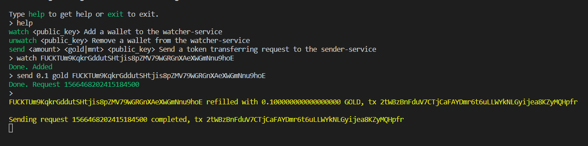

A set of GM Mint blockchain services.


# Watcher

Watcher service listens Mint blockchain for a new blocks/transactions and detects wallets' incoming transactions. \
ROI (e.g. a set of wallets to observe) could be changed via requests to the service. \
Incoming transactions are saved into storage. Upon saving, the service tries to notify it's consumer.

## Usage

Prepare `config.yaml`:
```yaml
# Log
log:
  level: info
  color: yes
  json: no
# API (one of)
api:
  # Nats interface (optional)
  nats:
    url: localhost:4222
    prefix: ""
  # HTTP interface (optional)
  http:
    port: 9000
# Database
db:
  driver: mysql
  dsn: user:password@tcp(localhost:3306)/mint_sender?collation=utf8_general_ci&timeout=10s&readTimeout=60s&writeTimeout=60s
  prefix: watcher
# Prometheus metrics (optional)
metrics: 2113
# Mint nodes
nodes:
  - 127.0.0.1:4010
```

Run the service:
```sh
./watcher
```

[Nats messages](pkg/watcher/nats/wallet/README.md)
[HTTP messages](pkg/watcher/http/README.md)


# Sender

Sender service handles a queue of payments (outgoing transactions). \
Serves requests to send tokens to the client's wallet from a set of predefined wallets (taking balances into account). \
Upon succesful sending, the service tries to notify it's consumers.

## Usage

Prepare `config.yaml`:
```yaml
# Log
log:
  level: debug
  color: yes
  json: no
# API (one of)
api:
  # Nats interface (optional)
  nats:
    url: localhost:4222
    prefix: ""
  # HTTP interface (optional)
  http:
    port: 9001
# Database
db:
  driver: mysql
  dsn: user:password@tcp(localhost:3306)/mint_sender?collation=utf8_general_ci&timeout=10s&readTimeout=60s&writeTimeout=60s
  prefix: sender
# Prometheus metrics (optional)
metrics: 2114
# Mint nodes
nodes:
  - 127.0.0.1:4010
# Sending wallets private keys
wallets:
  - PRIVATE_KEY
  - PRIVATE_KEY
```

Run the service:
```sh
./sender
```

[Nats messages](pkg/sender/nats/sender/README.md)
[HTTP messages](pkg/sender/http/README.md)


---


## Project

| Dir | Description |
| --- | ----------- |
| build    | Building artifacts, Docker files |
| cmd      | Apps' entrypoint |
| internal | Apps' internals |
| pkg      | Nats/HTTP messages, Protobuf schemes |
| scripts  | Building scripts |
| vendor   | Go vendoring |


## Transport

Services' primary transport is Nats server. Messages are serialized with Protobuf. \
Nats scheme: `.proto` file contains message scheme, `.go` file contains Nats subject names. \
Simple HTTP API now is supported as well.


## Storage

Currently there is only MySQL storage implemented, but it's not a problem to replace it with whatever. \
See DAO interfaces for specific service.


## Building

Ensure you have **Go 1.12** to build the project. \
**Protoc** should be installed in order to generate protocol mappings for Nats networking. \
\
Run once to check dependencies: `make deps` \
Build apps:
```sh
make build     # build executables
make dockerize # make a Docker image
```
Makefile builds services for Linux/AMD64 by default. \
Use `TARGETS` arg to change this behaviour. For instance:
```sh
make TARGETS="watcher/windows/amd64/ sender/windows/amd64/ testcli/windows/amd64"
```


## Testing

Setup MySQL database, run Nats, run Mint services and then run `go run cmd/testcli/main.go` to interact with the services. \


### Code test
Packages unit tests:
```sh
make test
```


## TODO

- [x] Instrumenting (Prometheus)
- [x] HTTP API
- [ ] More DB drivers 
